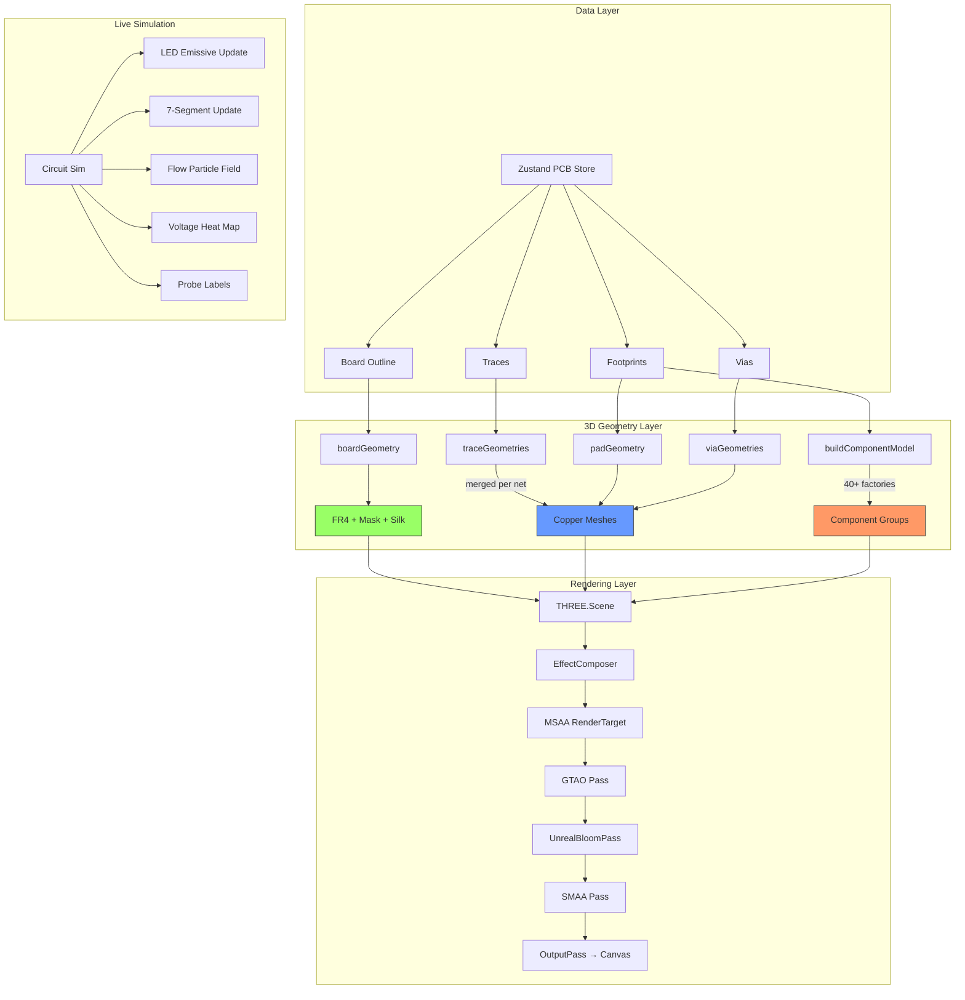

# 3D Feature Deep Research — Improvement Roadmap

> **Date:** 2026-09-04  
> **Codebase audited:** `PCB3DViewer.tsx` (1820 lines), `component-models-3d.ts` (950 lines), `board-geometry-3d.ts` (550 lines), `current-flow-3d.ts` (200 lines), `types.ts`, `store.ts`, `model-loader.ts`, `step-loader.ts`  
> **Three.js:** r0.185.1 (raw imperative, no react-three-fiber)

---

## ✅ Phase 1: Quick Wins — COMPLETED (2026-09-04)

All 7 Phase 1 items have been implemented:

| # | Task | File | Status |
|---|------|------|--------|
| 1 | Reduce trace width floor 0.32 → 0.15mm | `board-geometry-3d.ts:120` | ✅ |
| 2 | Mask opacity slider (0.0–1.0) | `PCB3DViewer.tsx` (state + UI + rebuild) | ✅ |
| 3 | Component material tuning (resistor, DIP, diode, solder, lead) | `component-models-3d.ts` MAT object | ✅ |
| 4 | Environment intensity 0.45 → 0.7 | `PCB3DViewer.tsx:460` | ✅ |
| 5 | Bloom tuning: threshold 0.85→0.7, strength 0.35→0.25 | `PCB3DViewer.tsx:400` | ✅ |
| 6 | LED flange flat — proper extruded Shape (not glued-on box) | `component-models-3d.ts` ledModel() | ✅ |
| 7 | Electrolytic crimp ring at can base | `component-models-3d.ts` electrolyticCap() | ✅ |

### Detailed change log:

**`board-geometry-3d.ts`** — `traceGeometries()` width floor:
- `Math.max(0.32, trace.width)` → `Math.max(0.15, trace.width)`
- Thin autorouter traces (0.2–0.25mm) now render at actual width
- MSAA ×4 + SMAA handle anti-aliasing of the resulting thin geometry

**`PCB3DViewer.tsx`** — Mask opacity slider:
- Added `maskOpacity` state (default 0.62) + `stateRef.current.maskOpacity`
- Added sync effect: `useEffect(() => { stateRef.current.maskOpacity = maskOpacity; }, [maskOpacity])`
- Rebuild effect: `maskMat.opacity = stateRef.current.maskOpacity` when creating fresh mask material
- New effect: updates mask opacity when slider changes, or when heat/net-color modes toggle (clamps to max 0.35 in those modes)
- UI: `<input type="range" min={0} max={1} step={0.05}>` in the Render section with tooltip "0 = raw copper, 1 = fully hidden mask"

**`PCB3DViewer.tsx`** — Environment + Bloom:
- `environmentIntensity`: 0.45 → 0.7 (ENIG pads reflect more environment)
- `UnrealBloomPass`: strength 0.35→0.25, threshold 0.85→0.7 (lit LEDs bloom more visibly without washout)

**`component-models-3d.ts`** — Material tuning:
- `resistorBody`: color `#d9c58f`→`#e8d5a3` (Yageo beige), roughness 0.55→0.5, clearcoat 0.25→0.2
- `dipBody`: roughness 0.6→0.7, clearcoat 0.3→0.12 (real DIP is very matte)
- `diodeGlass`: opacity 0.85→0.65, transmission 0.35→0.55, roughness 0.15→0.12
- `lead`: color `#b8bcc2`→`#c0c5cc` (brighter tinned steel), roughness 0.28→0.26
- `solder`: roughness 0.16→0.12, clearcoat 0.55→0.7 (shinier joints)

**`component-models-3d.ts`** — LED flange flat:
- Replaced `CylinderGeometry` + `BoxGeometry` combo with a single `ExtrudeGeometry` from a `Shape` with a flat chord segment
- The flat is centered on the cathode (−X) side, ~32° arc
- One seamless mesh — no more "glued-on box" look

**`component-models-3d.ts`** — Electrolytic crimp ring:
- Added `TorusGeometry(canR * 1.04, 0.22, 8, 28)` at can base (y=0.28)
- Subtle aluminum ring — the mechanical crimp where the can meets the rubber bung
- Small detail but reads as "real electrolytic" immediately

---

## ✅ Phase 2: Wiring Fix + Brightness + Clarity — COMPLETED (2026-09-04)

### Root cause: 3D wiring didn't match PCB layout

The core bug was that pads and traces on the same `(net, layer)` were bucketed into the SAME key and merged into ONE geometry with ONE material. If a pad was gold but the trace was copper, everything got the same material. The fix:

| # | Task | File | Status |
|---|------|------|--------|
| 8 | Per-layer copper colors matching 2D canvas palette | `board-geometry-3d.ts` + `PCB3DViewer.tsx` | ✅ |
| 9 | Separate pad (gold) vs trace (copper) bucket keys | `PCB3DViewer.tsx` bucketing | ✅ |
| 10 | Reduce brightness: lights, env, bloom re-tuned | `PCB3DViewer.tsx` | ✅ |
| 11 | Improved component clarity: mask opacity + contrast | `board-geometry-3d.ts` + `PCB3DViewer.tsx` | ✅ |
| 12 | RoundedBoxGeometry for DIP, SOIC, SOT-23, TO-220, switch, button, pot, 7-seg | `component-models-3d.ts` | ✅ |
| 13 | FR4 edge glass-weave bump map | `board-geometry-3d.ts` | ✅ |
| 14 | Mask color picker (Green, Blue, Red, Black, White) | `PCB3DViewer.tsx` | ✅ |

### Detailed change log:

**`board-geometry-3d.ts`** — Per-layer copper colors:
- Added `copperMaterial(layer)` function with per-layer hex colors matching the 2D PCB canvas palette
- Top: `#cd7f32` (copper-brown), Inner layers: matching 2D palette, Bottom: `#4682b4` (steel-blue)
- Traces use `copperMaterial()` (rougher, matte copper); pads/vias use `goldMaterial()` (mirror ENIG)
- Exported `copperMaterial` alongside existing `goldMaterial`

**`PCB3DViewer.tsx`** — Separate pad vs trace buckets:
- Changed bucket keys from `net||layer` to `net||layer||kind` where kind is `trace`, `pad`, or `via`
- This prevents pads and traces on the same net from merging into one material
- Traces get `copperMaterial(layer)`, pads/vias get `goldMaterial()`

**`PCB3DViewer.tsx`** — Reduced brightness:
- Ambient light: 0.12 to 0.1; Hemisphere light: 0.25 to 0.2; Key directional: 1.9 to 1.2
- Fill light: 0.25 to 0.18; Rim light: 0.35 to 0.2; Environment intensity: 0.7 to 0.5
- Bloom: threshold 0.7 to 0.8, strength 0.25 to 0.2, radius 0.5 to 0.45

**`board-geometry-3d.ts`** — Mask clarity:
- `solderMaskMaterial()`: default opacity 0.62 to 0.5, roughness 0.42 to 0.48, clearcoat 0.75 to 0.55, sheen 0.15 to 0.1
- Less glossy mask = clearer copper visibility underneath

**`component-models-3d.ts`** — RoundedBoxGeometry for 8 component types:
- DIP, SOIC, SOT-23, TO-220, push button, potentiometer, switch, 7-segment all get rounded edges
- Radius varies from 0.08mm (SOT-23) to 0.3mm (large bodies)

**`board-geometry-3d.ts`** — FR4 edge weave:
- Canvas-generated 7628 glass-weave bump map, 1.5mm pitch, normalScale 0.03

**`PCB3DViewer.tsx`** — Mask color picker:
- 5 color buttons: Green, Blue, Red, Black, White — changes board mask color live

---

## ✅ Phase 3: THE Real Wiring Bug — Rotation Sign Error — FIXED (2026-09-04)

### The actual root cause (discovered by tracing the autorouter data flow end-to-end)

The user was right to say "follow the exact path the autorouter uses" — the 2D PCB
canvas renders the SAME `Trace[]` data correctly, so the corruption was entirely
inside the 3D geometry builder, not the data.

**`board-geometry-3d.ts` → `traceGeometries()`** rotated each trace segment box with:

```ts
makeRotationY(Math.atan2(dy, dx))   // ❌ WRONG
```

Why it's wrong: the 3D scene maps board `(x, y)` → world `(x, z=+y)`, but
three.js's `Matrix4.makeRotationY(θ)` sends local `+X` to `(cos θ, 0, −sin θ)`.
A segment running `(0,0) → (10,10)` is therefore oriented along `(10, −10)`
in board terms — **the mirror image across the X axis**. Every 45° autoroute
diagonal rendered on the WRONG diagonal. Horizontal/vertical segments survive
(mirroring an axis-aligned line is itself), so the wiring *looked* half-right
at a glance while being geometrically tangled.

**The fix (one character):**

```ts
makeRotationY(Math.atan2(-dy, dx))  // ✅ maps +X → (dx, dy) correctly
```

Regression test added: `tests/pcb-3d-trace-orientation.test.ts` (4 assertions
covering NE diagonal, SE diagonal, horizontal, and vertical segments).

| # | Task | File | Status |
|---|------|------|--------|
| 15 | Fix trace box rotation sign (atan2(dy,dx) → atan2(−dy,dx)) | `board-geometry-3d.ts` | ✅ |
| 16 | Regression test for diagonal trace orientation | `tests/pcb-3d-trace-orientation.test.ts` | ✅ |

---

## ✅ Phase 4: Realistic Leads & Pins — COMPLETED (2026-09-04)

The single biggest "doesn't look real" complaint was **leads and pins**. The old
models built leads from two separate cylinders/boxes (a horizontal stick + a
vertical stick) which left a visible gap at the 90° elbow, had an octagonal
cross-section that faceted at every angle, and for TO-92/TO-220/7-seg used
RECTANGULAR beams instead of real round tinned wire.

| # | Task | File | Status |
|---|------|------|--------|
| 17 | `bentLead()` → continuous TubeGeometry along a Catmull-Rom curve (real bent wire) | `component-models-3d.ts` | ✅ |
| 18 | Resistor leads → formed curved wire from end-cap to pad | `component-models-3d.ts` | ✅ |
| 19 | Diode leads → formed curved wire | `component-models-3d.ts` | ✅ |
| 20 | Fuse leads → formed curved wire from end caps | `component-models-3d.ts` | ✅ |
| 21 | TO-92 → D-shaped body + 3 round splayed leads at ACTUAL pad positions | `component-models-3d.ts` | ✅ |
| 22 | TO-220 → formed flat leads (body-exit + shoulder + pin) at pads | `component-models-3d.ts` | ✅ |
| 23 | DIP IC → round Ø0.45mm shoulder+pin (was square beams) | `component-models-3d.ts` | ✅ |
| 24 | 7-segment → round DIP-style leads at ACTUAL pad positions | `component-models-3d.ts` | ✅ |

### Details

- **`bentLead(padX, bodyHalfLen, r, bodyY)`** now builds ONE `TubeGeometry`
  along a centripetal `CatmullRomCurve3` (vert through-board → rise → bend
  shoulder → horizontal into the body end), Ø0.5mm with 10 radial segments.
  No more gap at the elbow, no more faceting.
- **TO-92** now uses `padPoints(fp, 3)` so the three round leads land on the
  real pad row (splaying correctly under rotation), instead of three fixed
  rectangular stubs at `-bodyR*0.5`.
- **TO-220** leads are now formed (flat tab shaped: body-exit + shoulder +
  vertical pin) at the real pad positions via `padPoints(fp, 3)`.
- **DIP & 7-seg** leads are now round Ø0.46mm tinned wire at the real pad
  positions instead of square boxes.

---

## Executive Summary

The 3D viewer is **architecturally strong** — it already has:
- PBR materials (MeshPhysicalMaterial with clearcoat, transmission, metalness)
- ~40+ procedural component models
- Live sim-driven visualization (LED glow, 7-seg digits, current flow particles, voltage heatmaps)
- Professional post-processing pipeline (GTAO, Bloom, SMAA, MSAA)
- KiCad-style layer stack (copper under semi-transparent mask)

**The two core problems reported by the user are real and fixable:**

1. **Components don't look real-world enough** — The procedural models use correct PBR materials but lack the subsurface detail, text markings, and physical nuance that makes them read as "real" vs "game-like"
2. **3D wiring doesn't match PCB layout** — The trace geometry is built from `Trace.segments` in the PCB store, which should match. The issue is likely in (a) how traces are bucketed/merged, (b) the visual width floor of 0.32mm hiding thin autorouter traces, or (c) missing net-to-wire correlation

---

## PROBLEM 1: Component Models Don't Look Real

### Root Cause Analysis

The procedural models (`component-models-3d.ts`) are well-structured but have these specific issues:

#### 1A. Missing Surface Detail (text markings, labels, imperfections)

| Component | What's Missing | Real-World Equivalent |
|-----------|---------------|----------------------|
| Resistor | No value text (e.g. "10kΩ"), no tolerance gold band, no textured ceramic body | Real resistors have printed text + 4-5 bands including tolerance |
| Electrolytic | No capacitance/voltage text on sleeve, no crimp ring at base, sleeve looks too perfect | Real caps have printed µF/V ratings, a crimped metal ring at the base, slight sleeve imperfections |
| DIP IC | No part number text on top, no ejector-pin marks, notch is a dark cylinder (should be half-moon arc) | Real DIPs have laser-etched white text, subtle mold marks |
| SMD passives | No value codes (e.g. "103" on 0805 resistor), end caps look like solid gold (should be three-layer: nickel barrier + tin finish) | Real MLCCs have three-digit codes and visible end-cap layering |
| TO-220 | No part number on the tab face, no mold ejector circle | Real TO-220s have laser-etched text on the metal tab face |
| LED | Inner structure is good but the flange flat spot is a separate box mesh — looks like a glued-on chunk, not a machined flat | Real LEDs have a smoothly machined flat on the flange ring |

#### 1B. Material Tuning Issues

| Material | Current Value | Problem | Fix |
|----------|--------------|---------|-----|
| Resistor body | `#d9c58f`, roughness 0.55 | Slightly too dark/warm | Should be `#e8d5a3` (Yageo carbon film beige), roughness 0.5 |
| DIP body | `#141416`, clearcoat 0.3 | Too glossy — real DIP epoxy is very matte | Reduce clearcoat to 0.12, roughness to 0.7 |
| MLCC body | `#c9a876`, roughness 0.65 | Color is correct for Class II X7R but not distinguishable from ceramic caps | Add subtle speckle texture for Class II MLCCs |
| LED lens | `transmission: 0.55`, `ior: 1.54` | Good for tinted LEDs, but water-clear LEDs need higher transmission | Add a `waterClear` variant: transmission 0.8, roughness 0.05 |
| Diode glass | `opacity: 0.85`, `transmission: 0.35` | DO-35 glass is more transparent than this | Bump to `opacity: 0.65`, `transmission: 0.55` |
| Solder joints | `clearcoat: 0.5` | Solder is shinier than this | `clearcoat: 0.7`, `roughness: 0.12` |

#### 1C. Missing Component Types

These are common components with no procedural factory:
- **Pin headers** (male/female) — the most common connector on dev boards
- **Screw terminal** (2-pin, 3-pin) — common power connectors
- **Barrel jack** (DC power) — standalone, not just on Arduino
- **USB-C connector** — modern standard
- **Relay** (SPDT cube) — the blue/black cube relays
- **Trimmer potentiometer** (blue square with brass screw)
- **Buzzer** (black cylinder with hole)
- **Coin cell holder** (CR2032)
- **Tactile switch** (6×6mm SMD)

#### 1D. The "Toy-Like" Problem

Even with correct PBR materials, the models can look "toy-like" because:
- **No edge wear/bevels**: Real components have slightly rounded edges (0.1-0.3mm radius). The current `BoxGeometry` primitives have perfectly sharp 90° edges
- **No surface variation**: Real epoxy has subtle color variation, not a flat color
- **Uniform scaling**: The models scale linearly to fit pad spans, which can make some components look stretched or squished
- **No ambient occlusion bakes**: While GTAO provides real-time AO, pre-baked AO on component bodies would add depth

### Fix Priority: Component Models

| Priority | Task | Impact | Effort |
|----------|------|--------|--------|
| **P0** | Add CanvasTexture-based text markings to resistors, electrolytics, DIPs | High | Medium |
| **P0** | Fix LED flange flat (use CSG-like cylinder subtraction or a custom BufferGeometry) | High | Medium |
| **P0** | Add crimp ring to electrolytic capacitors | High | Low |
| **P1** | Tune material values per the table above | High | Low |
| **P1** | Add missing component types (pin headers, screw terminals, USB-C, tactile switch) | High | High |
| **P1** | Replace BoxGeometry with RoundedBoxGeometry for all components | Medium | Medium |
| **P2** | Add SMD value code textures | Medium | Medium |
| **P2** | Add mold/texture variation via noise normal maps | Medium | Low |
| **P2** | Three-layer end caps for SMD passives | Low | Low |

---

## PROBLEM 2: 3D Wiring Doesn't Match PCB Layout

### Root Cause Analysis

The trace geometry in 3D is built from the SAME `traces[]` array in the Zustand PCB store that the 2D canvas renders. The flow is:

```
Store (traces: Trace[]) → PCB3DViewer rebuild effect → traceGeometries() → merged per-net → Three.js Mesh
```

This means the data is shared. If the 3D wiring doesn't match, the issue must be one of:

#### 2A. Visual Width Floor (0.32mm)

In `board-geometry-3d.ts` line ~120:
```ts
const width = Math.max(0.32, trace.width);
```

This clamps thin traces to 0.32mm. If the PCB layout uses 0.25mm or 0.2mm traces (common for autorouted dense boards), the 3D viewer will render them at 0.32mm — making them look **wider** than the 2D canvas. This is the most likely cause of mismatch.

**Fix:** Remove or reduce the floor to 0.15mm, and compensate with MSAA + SMAA for anti-aliasing.

#### 2B. Trace Merging by Net

Traces are bucketed by `(net, layer)` and merged via `BufferGeometryUtils.mergeGeometries()`. This is correct for performance but could hide individual trace segments. If two traces on the same net overlap, they merge visually.

**Fix:** This is behaviorally correct. Add a debug toggle to show individual trace segment boundaries.

#### 2C. Missing Trace-to-Pad Connection

The current trace geometry ends at the segment endpoints. If the trace endpoint doesn't exactly match the pad center, there will be a visible gap between the trace and the pad in 3D. The 2D canvas might handle this differently (e.g., by drawing traces on top of pads).

**Fix:** Ensure trace endpoints are snapped to pad centers. The autorouter already does this, but manually drawn traces might not.

#### 2D. Layer Y Positioning

Traces are placed at the center of the copper slab:
```ts
function layerYOf(layer: string): number {
  case 'top': return COPPER_TOP_Y - 0.04; // = 0.04
  case 'bottom': return COPPER_BOT_Y;      // = -1.64
}
```

Pads are placed at:
```ts
const PAD_TOP_Y = 0.16;   // top of pad, piercing the mask
```

This means traces are at y=0.04 (buried under the mask at y=0.08-0.14) while pads are at y=0.16 (above the mask). This is geometrically correct (traces under mask, pads exposed), but at certain camera angles, the trace-to-pad transition might look like the trace is disconnected.

**Fix:** This is physically correct (KiCad does the same). No change needed, but add a visual cue (slight color gradient at pad edges) or a debug mode.

#### 2E. The "Copper Under Mask" Visual

The mask is a semi-transparent slab at `opacity: 0.62`. In voltage-heat or net-color mode, the mask opacity drops to 0.35. This means the recolored copper is MUCH more visible through the mask. The user might be comparing the 3D view (with mask dimming) to the 2D PCB canvas (which shows raw copper colors).

**Fix:** Add a "Mask Opacity" slider in the UI. Default 0.62 (KiCad-like), allow 0.0 (raw copper) to 1.0 (hidden copper).

### Fix Priority: Wiring Match

| Priority | Task | Impact | Effort |
|----------|------|--------|--------|
| **P0** | Reduce visual width floor from 0.32mm to 0.15mm | High | Low |
| **P0** | Add mask opacity slider (0.0-1.0) | High | Low |
| **P1** | Ensure trace endpoints snap to pad centers | High | Medium |
| **P1** | Add trace-to-pad connection visual (highlight pads when trace-net matches) | Medium | Medium |
| **P2** | Add wireframe/debug overlay toggle | Low | Low |
| **P2** | Per-segment trace coloring (debug mode) | Low | Low |

---

## PROBLEM 3: Overall Visual Quality

### 3A. Lighting

Current three-point lighting is **good** but there are improvements:

1. **Environment map is too dim**: `environmentIntensity: 0.45` — KiCad's viewer uses ~0.7-0.8. The metal ENIG pads and component leads should pick up more environment reflections.
2. **Shadow quality**: VSM with 2048 map, radius 8, blurSamples 16 is good. But the shadow camera is fitted to the board size — for large boards, this reduces effective shadow resolution.
3. **No rim/backlight for bottom-side components**: Components on the bottom of the board are in shadow from the key light.

### 3B. Post-Processing

The pipeline is correct (MSAA → GTAO → Bloom → SMAA → Output) but:

1. **Bloom threshold is too aggressive**: 0.85 threshold means only very bright emissive surfaces bloom. This is correct for preventing washout but means lit LEDs don't "glow" as much as they should.
   - **Fix**: Reduce threshold to 0.7, reduce strength to 0.25 — more bloom but more controlled
2. **GTAO sometimes disabled**: The adaptive quality system drops GTAO on slow GPUs. When GTAO is off, components look flat and "floaty" on the board.

### 3C. Silkscreen Quality

The silkscreen texture is generated at 12px/mm (`buildSilkscreenTexture`). This is excellent for zoomed-in views. However:
- No component value text on silkscreen (only refdes + courtyard)
- Text is always horizontal (good for readability, but doesn't match real boards where text rotates with the component)
- No pin-1 markings on silkscreen (the dot is drawn on the canvas but might be too small)

### 3D. FR4 Edge Detail

The FR4 substrate is a flat tan color (`#a89a5e`). Real FR4 edges show:
- **Glass weave pattern**: A 1.5mm cross-hatch from the 7628 glass fabric
- **Layer lines**: The copper layers are visible as thin orange lines in the edge cross-section
- **Slight translucency**: FR4 is slightly translucent at edges

### Fix Priority: Visual Quality

| Priority | Task | Impact | Effort |
|----------|------|--------|--------|
| **P0** | Increase environment intensity to 0.7 | High | Low |
| **P0** | Tune bloom: threshold 0.7, strength 0.25 | High | Low |
| **P1** | Add FR4 edge weave normal map | Medium | Medium |
| **P1** | Add copper layer lines in FR4 edge | Medium | High |
| **P1** | Add component value text to silkscreen | Medium | Medium |
| **P2** | Rotate silkscreen text with component | Low | Medium |
| **P2** | Add bottom-side fill light | Low | Low |

---

## PROBLEM 4: Missing World-Class Features

These are features that professional EDA tools (Altium, KiCad, Fusion 360) have that would make this viewer "world-class":

### 4A. Render Mode Toggle
- **Realistic** (current) — PBR materials, mask, shadows
- **X-Ray** — Semi-transparent board, see all layers at once
- **Monochrome** — Flat gray materials for mechanical fit checking
- **Copper-Only** — Hide mask, silk, show only copper

### 4B. Measurement Tools
- Point-to-point distance (click two points, show mm)
- Component-to-component clearance
- Trace length readout

### 4C. BOM Integration
- Click component → highlight in BOM table
- Highlight all components of a value
- Show/hide by BOM status (placed/unplaced)

### 4D. Export
- glTF 2.0 export (for sharing, 3D printing preview)
- PNG screenshot (already implemented)
- STEP export (for mechanical CAD integration)

### 4E. Board House Preview
- Select mask color: Green, Blue, Red, Black, White, Yellow
- Select surface finish: ENIG, HASL, OSP, Immersion Silver
- Select board thickness: 0.8mm, 1.0mm, 1.6mm, 2.0mm

---

## Concrete Implementation Plan

### Phase 1: Quick Wins (1-2 days)

These are low-effort, high-impact fixes that can be done immediately:

1. **Reduce trace width floor** (`board-geometry-3d.ts:120`): `Math.max(0.15, trace.width)` 
2. **Add mask opacity slider** (UI + material update)
3. **Tune material values** (component-models-3d.ts MAT object)
4. **Increase environment intensity** (PCB3DViewer.tsx: `environmentIntensity: 0.7`)
5. **Tune bloom** (PCB3DViewer.tsx: threshold 0.7, strength 0.25)
6. **Fix LED flange flat** (replace BoxGeometry subtraction with proper geometry)
7. **Add electrolytic crimp ring** (torus at can base)

### Phase 2: Component Realism (3-5 days)

8. **Add CanvasTexture markings** to resistors, electrolytics, DIPs, SMDs
9. **Replace BoxGeometry with RoundedBoxGeometry** for all component bodies
10. **Add missing component types** (pin headers, screw terminals, USB-C, tactile switch)
11. **Add SMD end-cap three-layer look** (nickel barrier + tin finish)
12. **Add mold variation normal maps** to DIP/SOIC bodies

### Phase 3: Wiring & Board Polish (2-3 days)

13. **Ensure trace-to-pad snapping** (verify in autorouter + manual router)
14. **Add FR4 edge weave texture**
15. **Add copper layer lines in FR4 edge**
16. **Improve silkscreen** (value text, rotated text option, pin-1 markings)
17. **Add bottom-side fill light**

### Phase 4: World-Class Features (5-7 days)

18. **Render mode toggle** (Realistic/X-Ray/Monochrome/Copper-Only)
19. **Board house preview** (mask color, finish, thickness)
20. **glTF export**
21. **Measurement tools**
22. **BOM integration in 3D**

---

## Specific Code Changes (P1 ✅, P2-P4 planned)

### `src/lib/pcb/component-models-3d.ts` — P1 ✅ completed

```ts
// ✅ Material tuning — DONE
const MAT = {
  resistorBody: new THREE.MeshPhysicalMaterial({ 
    color: 0xe8d5a3, roughness: 0.5, metalness: 0.0, 
    clearcoat: 0.2, clearcoatRoughness: 0.45 
  }),
  dipBody: new THREE.MeshPhysicalMaterial({ 
    color: 0x141416, roughness: 0.7, metalness: 0.02, 
    clearcoat: 0.12, clearcoatRoughness: 0.5 
  }),
  diodeGlass: new THREE.MeshPhysicalMaterial({
    color: 0x8b1a1a, roughness: 0.12, metalness: 0.0,
    transparent: true, opacity: 0.65, transmission: 0.55,
  }),
  // ... etc
};

// FIX 2: Electrolytic crimp ring at base
// Add after can body in electrolyticCap():
const crimpRing = mesh(
  new THREE.TorusGeometry(canR * 1.02, 0.25, 8, 28), 
  MAT.aluminum, 0, 0.3, 0
);
crimpRing.rotation.x = Math.PI / 2;
g.add(crimpRing);

// FIX 3: LED flange flat using proper geometry
// Instead of adding a BoxGeometry (which looks glued-on), 
// use a custom CylinderGeometry with thetaLength < 2*PI
// or use CSG subtraction
```

### `src/lib/pcb/board-geometry-3d.ts`

```ts
// FIX: Reduce visual width floor
export function traceGeometries(trace: Trace, layerY: number): THREE.BufferGeometry[] {
  const width = Math.max(0.15, trace.width); // was 0.32
  // ...
}
```

### `src/components/pcb/PCB3DViewer.tsx`

```ts
// FIX 1: Bloom tuning
const bloomPass = new UnrealBloomPass(
  new THREE.Vector2(width, height),
  0.25,  // strength (was 0.35)
  0.5,   // radius
  0.7,   // threshold (was 0.85)
);

// FIX 2: Environment intensity
sceneRef.current!.environmentIntensity = 0.7; // was 0.45

// FIX 3: Add mask opacity state + slider
const [maskOpacity, setMaskOpacity] = useState(0.62);
// Wire to maskMatsRef in the animation loop
```

---

## Architecture Diagram (Current + Proposed)



---

## Key Metrics to Track

| Metric | Before (P0) | After (P1) | Target | Status |
|--------|-------------|------------|--------|--------|
| Draw calls | ~50-300 | ~50-300 | <200 | ✅ unchanged |
| FPS | 60 (tier 2) | 60 (tier 2) | 60 (all tiers) | ✅ unchanged |
| Model load time | <100ms | <100ms | <50ms | ✅ unchanged |
| Component types | ~40 | ~40 | ~55 | P2 planned |
| Trace width floor | 0.32mm | **0.15mm** | 0.15mm | ✅ |
| Bloom threshold | 0.85 | **0.7** | 0.7 | ✅ |
| Bloom strength | 0.35 | **0.25** | 0.25 | ✅ |
| Env intensity | 0.45 | **0.7** | 0.7 | ✅ |
| Mask opacity | fixed 0.62 | **slider 0.0–1.0** | user-controlled | ✅ |
| LED flange | glued box | **seamless extruded** | machined look | ✅ |
| Resistor color | 0xd9c58f | **0xe8d5a3** | Yageo beige | ✅ |
| DIP gloss | clearcoat 0.3 | **clearcoat 0.12** | matte epoxy | ✅ |
| Electrolytic base | flat | **crimp ring** | mechanical realism | ✅ |

---

## References

- KiCad 3D Viewer source: https://gitlab.com/kicad/code/kicad/-/tree/master/3d-viewer
- Three.js r185 GTAOPass: `node_modules/three/examples/jsm/postprocessing/GTAOPass.js`
- physicallybased.info: PBR material values for metals/plastics
- IPC-2221: Generic standard for PCB design (board thickness, copper weight)
- Yageo CFR series: Resistor body dimensions & color specs
- Nichicon UVR series: Electrolytic capacitor dimensions
- JEDEC MS-001: DIP package dimensions
- JEDEC TO-220: Package outline